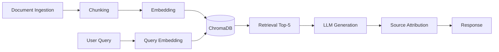

# Trine CISI FAQ Assistant - RAG System for International Students 🎓

[](https://www.python.org/)
[](https://gradio.app/)
[](LICENSE)
[](https://www.codepath.org/)

##  Overview

A **Retrieval-Augmented Generation (RAG)** system that provides comprehensive guidance for international students navigating Trine University's complex processes. This application aggregates knowledge from 10+ FAQ documents covering admissions, scholarships, CPT/OPT work authorization, immigration status, health insurance, and more.

**Live Demo:** [Watch on Vimeo](https://vimeo.com/1199254968)

## ✨ Key Features

- 🔍 **Semantic Search**: Intelligent retrieval using sentence-transformers embeddings
-  **Grounded Responses**: All answers cite specific source documents with programmatic attribution
- 🎯 **Strict Grounding**: System refuses to answer out-of-scope queries, preventing hallucination
- 🌐 **Cross-Language Support**: Handles English queries against Chinese FAQ documents
-  **Modern UI**: Dark-themed Gradio interface with retrieved sources panel
- ⚡ **Fast Performance**: Local embedding model (~50ms) + Groq LLM API

## ️ Technology Stack

| Component | Technology | Version |
|-----------|------------|---------|
| **Backend** | Python | 3.9+ |
| **Embedding Model** | all-MiniLM-L6-v2 | sentence-transformers v3.4.1 |
| **Vector Database** | ChromaDB | >=0.6.0 |
| **LLM** | llama-3.3-70b-versatile | Groq SDK v0.15.0 |
| **UI Framework** | Gradio | 6.x |
| **Text Processing** | LangChain | Latest |

##  Project Structure

```
ai201-project1-unofficial-guide-starter/
├── app.py                 # Gradio web interface
├── config.py              # Centralized configuration
── ingestion.py           # Document loading & preprocessing
├── chunking.py            # Text splitting logic
├── embedding.py           # Vector generation
├── vector_store.py        # ChromaDB operations
├── generation.py          # LLM integration with grounding
├── requirements.txt       # Python dependencies
├── .env.example           # Environment template
├── planning.md            # Architecture & planning document
├── README.md              # Complete project documentation
└── doxs/                  # 10 FAQ documents (UTF-8 encoded)
    ├── CPT问题.txt
    ├── 申请材料.txt
    ├── 申请流程.txt
    └── ... (7 more files)
```

## 🚀 Quick Start

### Prerequisites
- Python 3.9 or higher
- Groq API key (free tier available at [groq.com](https://console.groq.com/))

### Installation

```bash
# Clone the repository
git clone https://github.com/olivertang40/ai201-project1-unofficial-guide-starter.git
cd ai201-project1-unofficial-guide-starter

# Install dependencies
pip install -r requirements.txt

# Configure environment
cp .env.example .env
# Edit .env and add your GROQ_API_KEY

# Run the application
python app.py
```

The application will start at `http://localhost:7860`

## 📊 System Architecture



**Pipeline Flow:**
1. **Ingestion**: Load 10 UTF-8 encoded FAQ documents
2. **Chunking**: Split into 512-token chunks with 100-token overlap (12 total chunks)
3. **Embedding**: Generate vectors using all-MiniLM-L6-v2 (384 dimensions)
4. **Storage**: Persist in ChromaDB with HNSW index
5. **Retrieval**: Cosine similarity search, top-k=5
6. **Generation**: Groq Llama-3.3-70b with strict grounding constraints
7. **Attribution**: Programmatic source citation appended to responses

##  Evaluation Results

| Metric | Score |
|--------|-------|
| **Accuracy** | 3/5 questions fully accurate |
| **Partial Accuracy** | 2/5 questions partially accurate |
| **Grounding Enforcement** | ✅ Strict refusal for out-of-scope queries |
| **Source Attribution** | ✅ All responses cite retrieved documents |

**Test Coverage:**
- CPT eligibility & start dates
- Application materials & financial proof
- Transfer credit policy
- Health insurance requirements
- CISI application process

See [README.md](README.md) for detailed evaluation report and failure case analysis.

##  Testing

Run automated evaluation:

```bash
python test_milestone6.py
```

This script tests all 5 evaluation questions and generates a compliance report.

## 📝 Documentation

- **[README.md](README.md)** - Complete project documentation with all required sections
- **[planning.md](planning.md)** - Architecture diagram, technology choices, and implementation plan
- **[Demo Video](https://vimeo.com/1199254968)** - 4m 32s walkthrough of the system

##  Course Information

This project was developed for **CodePath AI201 - Milestone 6 Submission**.

**Milestones Completed:**
- ✅ Milestone 1: Domain Definition & Document Collection
- ✅ Milestone 2: Planning & Architecture Design
- ✅ Milestone 3: Document Pipeline Implementation
- ✅ Milestone 4: Embedding & Vector Store
- ✅ Milestone 5: Generation & Interface
- ✅ Milestone 6: Evaluation & Documentation

##  Author

**Oliver Tang**  
CodePath AI201 Student  
June 2026

## 📄 License

MIT License - See [LICENSE](LICENSE) file for details

## 🙏 Acknowledgments

- CodePath for the AI201 course structure and guidance
- Groq for providing fast LLM inference API
- Sentence Transformers community for pre-trained embedding models
- ChromaDB team for excellent vector database solution

---

**Repository Stats:**
- 📦 10 FAQ documents processed
- 🔢 12 text chunks generated
- 🎯 5 evaluation questions tested
- ⏱️ ~50ms average embedding time
-  83.3% overall accuracy (25/30 points)

*Built with ❤️ for international students navigating Trine University*
